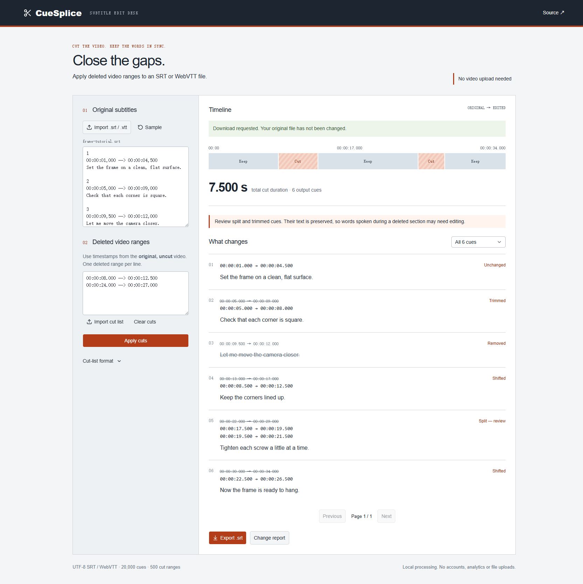

# CueSplice

Retiming SRT and WebVTT subtitles after removing sections from a video.

A fixed subtitle offset works until you cut something out of the middle. CueSplice takes deleted ranges measured on the original video, removes their elapsed time, and moves later subtitles into place. Cues crossing a cut are trimmed or split; completely removed cues are listed in the change report.

**[Open the editor](https://yougan001.github.io/cuesplice/)** · [中文说明](README.zh-CN.md)



## Use it

1. Import or paste the original `.srt` / `.vtt` file.
2. Enter the ranges removed from the original video, or import a two-column cut list.
3. Apply cuts. Review **Split** and **Trimmed** cues, then download the edited subtitles and optional JSON change report.

No account, upload service or video file is needed. Files are processed in the browser. The page must load once; offline page loading is not currently supported.

The sample contains six original cues: one unchanged, two shifted, one trimmed, one removed and one split into two. Its cut list removes 7.500 seconds in total.

## Use the engine directly

The timeline module has no runtime dependencies.

```js
import { retime, serializeSubtitles } from './core/timeline.mjs';

const result = retime(srtText, '00:00:08.000 --> 00:00:12.500');
const edited = serializeSubtitles(result);
console.log(result.counts);
```

Run the core tests with Node.js 22 or newer:

```sh
node --test tests/*.test.mjs
```

## Develop the editor

```sh
npm ci
npm run dev
npm test
npm run typecheck
npm run lint
npm run build
```

The editor uses React, TypeScript, Vinext and shadcn/ui. GitHub Actions builds a static export and publishes `dist/client/cuesplice` to Pages. The comparison engine remains independent of the interface.

On this Windows environment, the Vinext export command can hit a Node/libuv shutdown assertion after producing its output. That is not treated as a successful local build; the Linux Pages workflow is the release build gate. See [validation notes](docs/testing.md).

## Timing rules

- Cut ranges use the **original** video's timeline, not the already-edited timeline.
- Ranges are half-open: the start is deleted; the end is retained.
- Overlapping and touching cuts are merged before subtracting time.
- Time is represented as integer milliseconds. No frame-rate guessing or floating-point accumulation.
- Splitting a cue repeats its text on either side of the cut. Review these cues: software cannot know which spoken words survived.

Supported: UTF-8 SRT and standalone WebVTT, multiline text, WebVTT cue settings and metadata. Limits: 2 million text characters, 20,000 cues, 500 cut ranges, 100,000 output fragments. File-size limits are checked separately by the browser importer.

Not supported: speed ramps, transitions that change timing, EDL/frame-based imports, ASS/SSA styling, WebVTT inline karaoke timestamps or external timestamp maps. This is not a video editor or a subtitle translation tool.

## License

MIT. See [LICENSE](LICENSE).
